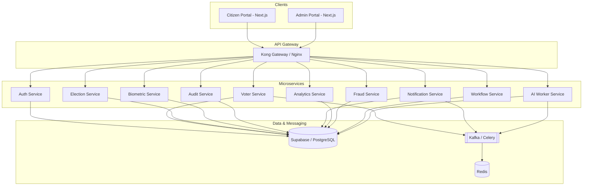

# 🏛️ National Secure Voting Portal

[](https://nextjs.org/)
[](https://fastapi.tiangolo.com/)
[](https://supabase.com/)
[](https://www.docker.com/)
[](https://kubernetes.io/)
[](#-security--compliance)

An enterprise-grade, high-security electoral infrastructure designed for secure voter registration, identity verification, and end-to-end election management. Built to adhere to the Election Commission of India (ECI) standards.

---

## 🏗️ Architecture Overview

The platform follows a **Modular Microservices Architecture**, ensuring high availability, scalability, and strict separation of concerns.



### 🛰️ Microservices Deep-Dive

| Service | Description | Technology |
| :--- | :--- | :--- |
| **Auth Service** | Identity management, JWT/RBAC, and MFA. | FastAPI, PostgreSQL |
| **Voter Service** | Registration (Form 6/7/8), profile management. | FastAPI, Celery |
| **Election Service** | Election lifecycle, constituency mapping. | FastAPI, PostgreSQL |
| **Biometric Service**| Encrypted fingerprint & facial vaulting. | FastAPI, OpenCV |
| **Audit Service** | Immutable transaction logging for transparency. | FastAPI, PostgreSQL |
| **Notification Service** | Real-time SMS/Email alerts via Celery. | FastAPI, Redis |
| **Analytics Service** | Voter turnout and demographic insights. | FastAPI, Pandas |
| **Fraud Service** | AI-driven duplicate detection & anomaly analysis. | FastAPI, Scikit-Learn |
| **Workflow Service** | Administrative approval pipelines (ECI Flow). | FastAPI, PostgreSQL |
| **AI Worker Service**| Heavy-duty processing for biometric & OCR. | FastAPI, PyTorch |

---

## 🛠️ Technology Stack

- **Frontend**: Next.js 14 (App Router), TypeScript, Tailwind CSS, Shadcn/UI.
- **Backend**: FastAPI (Python 3.10+), SQLAlchemy 2.0, Pydantic v2.
- **Data Persistence**: Supabase (PostgreSQL with RLS), Redis (Caching/Queue).
- **Asynchronous Tasks**: Celery with Redis/RabbitMQ.
- **Infrastructure**:
  - **Containerization**: Docker & Docker Compose.
  - **Orchestration**: Kubernetes (K8s) for production.
  - **IaC**: Terraform for cloud provisioning.
  - **Gateway**: Kong / Nginx.
  - **Monitoring**: Prometheus, Grafana, ELK Stack.

---

## 📂 Project Structure

```text
.
├── apps/
│   ├── frontend/          # Citizen Facing Portal (Next.js)
│   ├── admin-portal/      # ECI Administrative Dashboard (Next.js)
│   └── docs/              # Technical Documentation
├── services/
│   ├── auth_service/      # Authentication & Authorization
│   ├── voter_service/     # Voter Registration Logic
│   ├── election_service/  # Election & Constituency Management
│   ├── ...                # Other Microservices
├── shared/                # Common Models, Schemas, and Utils
├── infrastructure/
│   ├── docker/            # Docker configurations
│   ├── gateway/           # Kong/Nginx configurations
│   ├── k8s/               # Kubernetes Manifests
│   ├── terraform/         # Infrastructure as Code
│   └── monitoring/        # Prometheus & Grafana configs
├── scripts/               # Automation & Maintenance scripts
└── docker-compose.yml     # Local Development Orchestration
```

---

## 🚀 Getting Started

### Prerequisites

- **Docker & Docker Compose** (Recommended)
- **Node.js 18+**
- **Python 3.10+**

### Local Development Setup

1. **Clone the repository**:
   ```bash
   git clone <repo-url>
   cd voter_yoo
   ```

2. **Initialize Environment**:
   ```bash
   cp .env.example .env
   # Update Supabase and Service credentials in .env
   ```

3. **Spin up stack**:
   ```bash
   docker-compose up -d
   ```

4. **Verify Deployment**:
   Access the frontend at `http://localhost:3000` and individual services via the gateway.

---

## 🔐 Security & Compliance

- **DPDP Act 2023**: Strict compliance with Indian data protection laws.
- **Biometric Vaulting**: AES-256 encryption for all biometric templates.
- **Zero-Trust Architecture**: Mandatory MFA for administrative actions.
- **Auditability**: Every change to voter records is logged in an immutable audit trail.
- **Database Security**: Row-Level Security (RLS) enforced at the Supabase layer.

---

## 📄 License

**Private / Proprietary**. All rights reserved. Designed for the Election Commission of India (ECI) standards.
